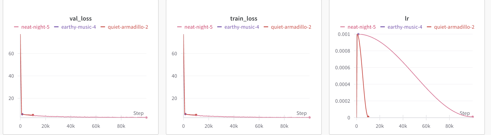

# 🧠 LLM from Scratch

This project implements a transformer-based language model **from scratch** — no `torch.nn.Linear`, no `torch.optim.Adam`, no `torch.nn.transformer`, no `torch.nn.CrossEntropyLoss`. Every core component of the model architecture and training pipeline is manually built using low-level PyTorch.

---

## ✨ Features

- ✅ Custom `Linear` and `Embedding` layers, `softmax`,`cross_entropy_loss`, `gradient clipping` and many more
- ✅ Custom `AdamW` optimizer with cosine learning rate scheduler
- ✅ Full Transformer block with:
  - Multi-head self-attention
  - Rotary positional embeddings (RoPE)
  - RMSNorm
  - SwiGLU feedforward network
- ✅ Tokenization with BPE + `np.memmap` streaming
- ✅ Autoregressive decoding with top-p sampling
- ✅ Integrated Weights & Biases (W&B) logging

---

## 📁 Project Structure

```
your_project/
├── scripts/              # Training and decoding entry points
│   ├── train.py
│   └── decode.py
|
├── models/               # Transformer model & layers
│   ├── __init__.py
│   ├── layers.py
│   └── attention.py
|   └── tokenizer.py
|   └── transformer.py
├── utilities/                # Data loading, optimization, training utils
│   ├── __init__.py
│   ├── data_utils.py
│   ├── config.py
│   └── training.py
├── optim/
│   ├── __init__.py
│   ├── adamw.py
├── configs/
│   └── train_config.yaml
├── checkpoints/
│   └── transformer_checkpoint.pt
└── README.md
```

---

## 🚀 Getting Started

### 1. Tokenization

You can either any tokenizer from HuggingFace. But I implemented my own BPE which is super faster, because I optimized using parallization and caching. Refer https://github.com/bargav25/fast_bpe

Follow that and it tokenizes your train and validation text into token_ids and store them to `.memmap` files


### 2. Train the model

```bash
python scripts/train.py --config configs/train_config.yaml --use_wandb
```

(If you're on a cluster, don’t forget to export your W&B API key first.)

### 3. Decode (generate text)

```bash
python scripts/decode.py
```

---

I trained my model on Tiny Stories dataset (~2.12 million documents) which took me around 2-3 hours on A100, and the results were pretty great.




## 🧪 Training Tips

- Use `np.memmap` for memory-efficient token loading
- Monitor `val_loss` in W&B to check overfitting
- Adjust `d_model`, `num_layers`, or `context_length` for capacity
- Use `<|endoftext|>` as a natural stopping token in decoding

---

## 📊 Sample Weights & Biases Integration

Enable with:
```bash
wandb login
python scripts/train.py --config configs/train_config.yaml --use_wandb
```

Track:
- 📉 Training & validation loss
- 🔁 Learning rate schedule
- 📦 Checkpoint intervals
- 🧠 Gradient norms

